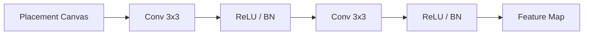

# CNN Encoder

The `CNNEncoder` processes the spatial representation of the placement grid (canvas) to extract spatial features and occupancy patterns.

## Architecture

A stack of 2D convolutional layers designed to preserve the spatial dimensions of the input grid.

## Features

- **Spatial Preservation**: Uses padding to ensure the output feature map has the same height and width as the input grid.
- **Configurable**: Allows specifying the number of channels and kernel sizes for each layer.
- **Integration**: Designed to provide the "spatial context" which is later combined with GNN node embeddings.

## Testing

The script tests/test_cnn.py verifies:
1. Preservation of spatial dimensions (height/width).
2. Correct output channel counts.
3. Forward pass stability with batched inputs.
