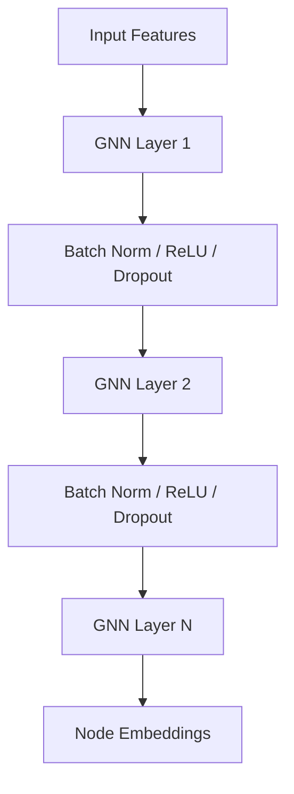

# GNN Encoder

The `GNNEncoder` produces high-dimensional embeddings for each node in the netlist, capturing the topological relationships between components.

## Architecture

The encoder is built using `torch-geometric` and supports multiple GNN layer types.

## Features

- **GNN Types**: Supports `GraphSAGE`, `GCN`, and `GAT`.
- **Flexibility**: Configurable number of layers, hidden dimensions, and dropout rates.
- **Node Selection**: Can return all embeddings or just the embedding for a specific `current_node`.

## Testing

The script tests/test_gnn.py verifies:
1. Model initialization and architecture printing.
2. Forward pass with full graphs.
3. Feature extraction for specific node batches.
4. Correctness of output shapes.
