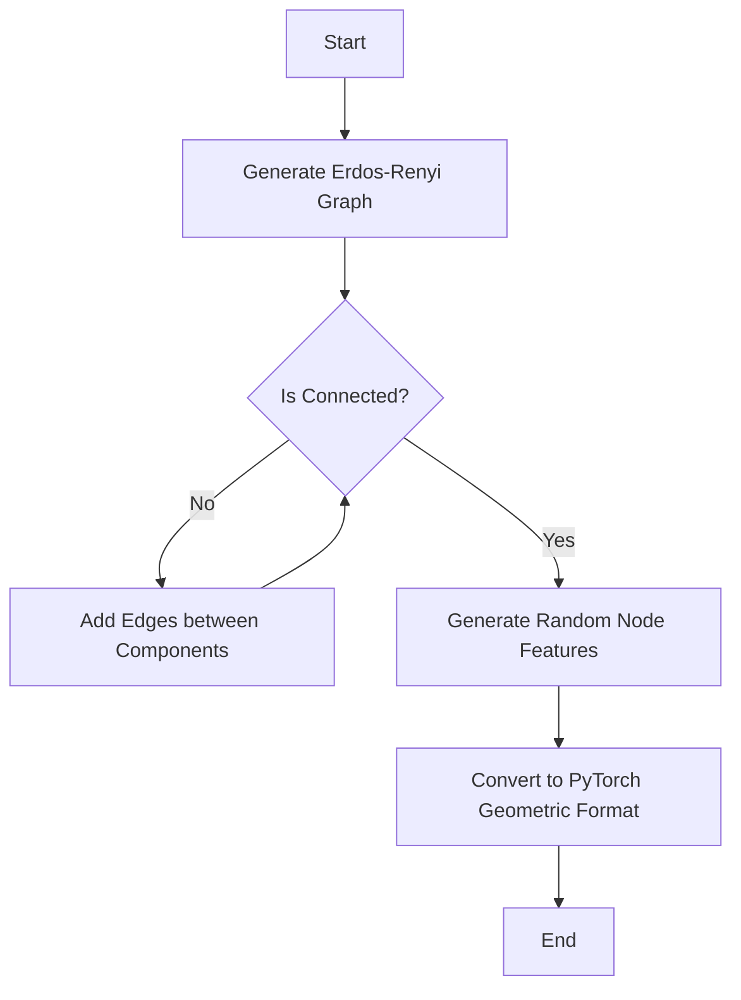

# Netlist Generator

The `NetlistGenerator` is responsible for creating synthetic circuit netlists (graphs) to train and evaluate the RL agent.

## Overview

It generates Erdos-Renyi random graphs and ensures they are connected by adding edges between disjoint components. This is crucial for maintaining a valid circuit structure where every component is reachable.

## High-Level Flow

## Key Methods

- `generate_erdos_renyi_graph(num_nodes, edge_probability, node_feature_dim)`: The primary method for generating a graph.
  - Generates a graph using `networkx`.
  - Ensures connectivity.
  - Returns node features (tensor), edge index (tensor), and the networkx graph object.

## Testing

The script tests/test_netlist.py verifies:
1. Graph connectivity after generation.
2. Correct shapes for node features and edge indices.
3. Visualization capability (saving to `test_netlist.png`).
